  

  

## > whoami

Sou estudante de Análise e Desenvolvimento de Sistemas, com foco em qualidade de software, automações, integrações ERP/API e desenvolvimento assistido por IA.

Tenho interesse em transformar processos operacionais complexos em soluções simples, organizadas e úteis no mundo real.

 

## > tech_stack.exe

### Frontend

### Backend & Dados

### ERP / Automação

### IA & Ferramentas

 

## > active_projects/

### Oráculo — Central de Demandas
Sistema local-first para organização de demandas, prazos, Kanban e histórico operacional. 
`Next.js` `TypeScript` `Prisma` `SQLite` 
[Ver projeto →](#)

### VFP Omie Automation
Automações e integrações com Omie ERP, planilhas e rotinas operacionais. 
`Apps Script` `APIs` `Omie ERP` `SQL` 
[Ver projeto →](#)

### Forge Gym MVP
App fitness com autenticação, treinos, histórico e dashboards de evolução. 
`Next.js` `TypeScript` `Supabase` `Tailwind` 
[Ver projeto →](#)

### Projeto IA Agentes
Experimentos com agentes locais, automação e IA integrada ao fluxo de desenvolvimento. 
`Python` `Ollama` `Claude` `Automação` 
[Ver projeto →](#)

 

## > connect

  
  
  

  <code> Código. Automação. Integração. Inteligência. █ </code>

