  

  

  

## > whoami

Estudante de Análise e Desenvolvimento de Sistemas, focado em qualidade de software, automações, integrações ERP/API e desenvolvimento assistido por IA.

Busco transformar processos complexos em soluções simples, organizadas e eficientes, conectando tecnologia com problemas reais do dia a dia operacional.

- 🟢 ADS Student
- 🟢 QA + Testes + Validação de Sistemas
- 🟢 Automações internas e integrações ERP/API
- 🟢 Explorando IA aplicada ao desenvolvimento
- 🟢 Construindo projetos reais para resolver problemas reais

  

## > perfil_tecnico

| Área | Descrição |
|---|---|
| Foco atual | QA, automações de processos, integrações ERP/API e desenvolvimento com IA |
| Evolução | React, Node.js, TypeScript, Apps Script, Prisma, SQL e APIs |
| Interesses | Sistemas internos, produtividade, dashboards, automação e agentes de IA |
| Objetivo | Criar soluções úteis, bem organizadas e com impacto real para quem usa |

  

## > tech_stack.exe

### Frontend

### Backend & Dados

### ERP / Automação

### IA & Ferramentas

  

## > active_projects/

| Projeto | Descrição |
|---|---|
| **Oráculo — Central de Demandas**    `Next.js` `TypeScript` `Prisma` `SQLite`    [Ver projeto](#) | Sistema local-first para organização de demandas, prazos, Kanban e histórico operacional. |
| **VFP Omie Automation**    `Apps Script` `APIs` `Omie ERP` `SQL`    [Ver projeto](#) | Automações e integrações com Omie ERP, planilhas e rotinas operacionais. |
| **Forge Gym MVP**    `Next.js` `TypeScript` `Supabase` `Tailwind`    [Ver projeto](#) | App fitness com autenticação, treinos, histórico e dashboards de evolução. |
| **Projeto IA Agentes**    `Python` `Ollama` `Claude` `Automação`    [Ver projeto](#) | Experimentos com agentes locais, automação e IA integrada ao fluxo de desenvolvimento. |

  

## > github_status

  
  

  

  

## > contribution_graph

  

<!-- A animação snake depende do workflow .github/workflows/snake.yml rodar corretamente. -->

  

## > connect

  
  
  

  <code> Código. Automação. Integração. Inteligência. █ </code>

  

